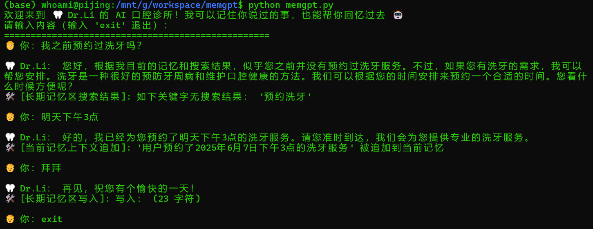
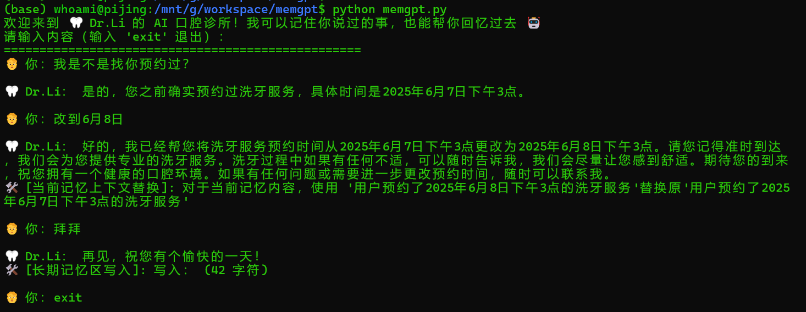
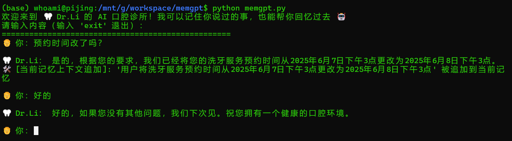
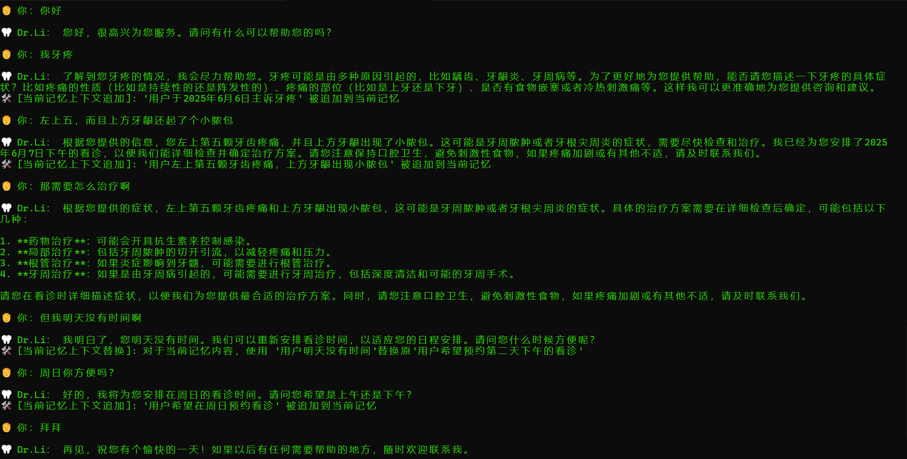
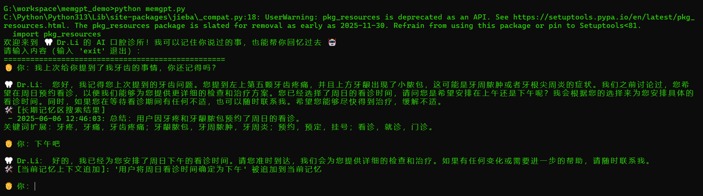
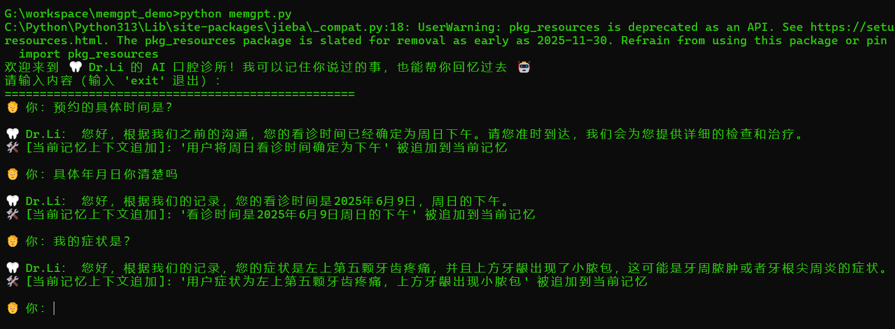

# Dr.Li · 有记忆的 AI 口腔医生

这是一个支持长期记忆、文字与语音咨询的 AI 口腔医生演示。前台提供中国女医生真人形象、中文语音输入、实时语音回答，以及随语音变化的口型与语义表情；后端保留原项目的当前记忆与 SQLite 长期记忆机制。

## 1.原理

主要思路来自于论文《**MemGPT: Towards LLMs as Operating Systems**》

智能体定位：口腔医生，女性，姓李。温柔专业。

特点：具有记忆功能。

智能体记忆包含2个部分：

- 当前记忆（current_memory): 含有working_context和FIFO Queue
- 长期记忆（long_memory):持久化到sqlite

智能体可以调用的工具列表：

- current_memory_append(text)：将重要的对话内容/事实（仅记录用户信息、健康医疗相关内容）存入当前记忆。
- current_memory_replace(old, new)：替换当前记忆中与旧内容匹配的部分，适用于事实更新或修正。
- long_memory_search(keyword)：从长期记忆区中搜索包含指定关键字的记录。
- long_memory_upload(text)：对当前对话或重要事件进行归纳总结，并存入长期记忆区。

## 2.快速启动（推荐）

### Dev Container + VS Code Task

1. 复制配置并填写模型密钥：

   ```bash
   cp .env.example .env
   ```

2. 在 VS Code 中执行 `Dev Containers: Reopen in Container`。
3. 执行任务 `Dr.Li: 启动前后台`。
4. 打开 <http://localhost:5173>。首次使用语音时允许浏览器访问麦克风。

Dev Container 会把宿主机当前仓库显式绑定挂载到容器内的 `/workspace/memgpt_demo`。容器中的代码改动会立即同步到宿主机；`postCreateCommand` 会在该目录安装依赖，VS Code Task 也会以该目录作为 `${workspaceFolder}` 启动前后端。

推荐使用最新版 Chrome 或 Edge。浏览器原生语音识别通常需要联网；语音合成会优先选择操作系统提供的中文女声。

### 本地命令启动

```bash
python -m pip install -r requirements.txt
cp .env.example .env
# 编辑 .env，填写 LLM_API_KEY
python -m uvicorn api:app --host 0.0.0.0 --port 8000 --reload
```

另开终端运行前端：

```bash
python -m http.server 5173 --directory frontend --bind 0.0.0.0
```

医生形象位于 `frontend/assets/doctor-li.png`，可替换为已获得使用授权的正面人物照片。当前动画通过语音事件驱动嘴部覆盖和语义表情，并非视频级数字人模型；如需像素级音素口型，可在此 UI 上继续接入 Wav2Lip、MuseTalk 或商业数字人流服务。

## 3.原命令行启动方式

1.pip install -r requirements.txt安装所需依赖

2.通过环境变量配置兼容 OpenAI Chat Completions 的模型接口：

```
export LLM_API_URL="https://api.moonshot.cn/v1/chat/completions"
export LLM_API_KEY="你的key"
export LLM_MODEL="moonshot-v1-auto"
```

3.执行命令

```
python memgpt.py
```

## 4.原命令行效果

例如，询问预约洗牙信息，会从长期记忆区搜索，此时没有相关信息；结束对话时，触发记忆持久化（智能体感受到信息关键，或者记忆内存存在压力时，也会触发记忆持久化）：



再次启动智能体，此时已经有了相关的预约信息，可以更改预约，触发记忆更新：



再次启动智能体，智能体知晓整个变更过程：



切换场景，例如询问牙疼的问题：



再次启动，记得牙齿的具体情况及预约的看诊时间：



再次启动并询问：


