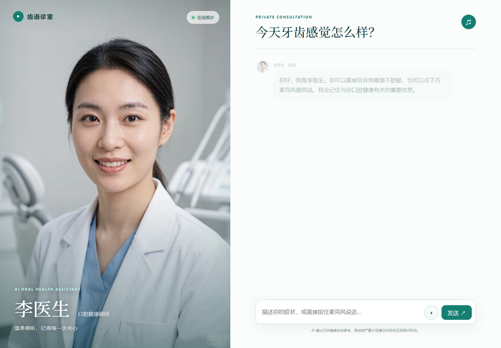

# Dr.Li · 有记忆的 AI 口腔医生

这是一个支持长期记忆、文字与语音咨询的 AI 口腔医生演示。Kimi 负责文本生成，OpenTalking QuickTalk 负责李医生实时音视频。后端保留当前记忆与 SQLite 长期记忆机制。



## 1.原理

主要思路来自于论文《**MemGPT: Towards LLMs as Operating Systems**》

智能体定位：口腔医生，女性，姓李。温柔专业。

特点：具有记忆功能。

智能体记忆包含2个部分：

- 当前记忆（current_memory): 含有working_context和FIFO Queue
- 长期记忆（long_memory):持久化到sqlite

智能体可以调用的工具列表：

- current_memory_append(text)：将重要的对话内容/事实（仅记录用户信息、健康医疗相关内容）存入当前记忆。
- current_memory_replace(old, new)：替换当前记忆中与旧内容匹配的部分，适用于事实更新或修正。
- long_memory_search(keyword)：从长期记忆区中搜索包含指定关键字的记录。
- long_memory_upload(text)：对当前对话或重要事件进行归纳总结，并存入长期记忆区。

这些记忆能力使用 OpenAI Chat Completions 兼容的原生 `tools/tool_calls` 协议：后端向模型声明 JSON Schema，按模型返回的 `tool_calls` 执行工具，并以对应的 `tool_call_id` 回传 `role=tool` 结果，直到模型生成最终答复。项目不再解析模型文本中的自定义工具标签。

## 2.快速启动（推荐）

### Dev Container + VS Code Task

1. 复制配置并填写 Kimi 密钥：

   ```bash
   cp .env.example .env
   ```

2. 在 VS Code 中执行 `Dev Containers: Reopen in Container`。
3. 执行任务 `Dr.Li: 启动前后台`。
4. 打开 <http://localhost:5173>。首次使用语音时允许浏览器访问麦克风。

Dev Container 会把宿主机当前仓库显式绑定挂载到容器内的 `/workspace/memgpt_demo`。容器中的代码改动会立即同步到宿主机；`postCreateCommand` 会在该目录安装依赖，VS Code Task 会以该目录作为 `${workspaceFolder}` 启动后端、前端和 OpenTalking 数字人服务。重复执行前先停止已有 task，避免端口冲突。

推荐使用最新版 Chrome 或 Edge。浏览器原生语音识别通常需要联网；医生回答语音不使用浏览器 TTS。

### 本地命令启动

```bash
python -m pip install -r requirements.txt
cp .env.example .env
# 编辑 .env，填写 LLM_API_KEY
python -m uvicorn api:app --host 0.0.0.0 --port 8000 --reload
```

另开终端运行前端：

```bash
python -m http.server 5173 --directory frontend --bind 0.0.0.0
```

数字人服务另开终端运行：

```bash
bash scripts/start_opentalking.sh
```

医生身份图位于 `frontend/assets/doctor-li.png`。OpenTalking 尚未启动时，页面仍可进行文字咨询，但不会播放数字人音视频。

## 3. OpenTalking 数字人

### 3.1 安装

Dev Container 重建完成后，在容器终端执行：

```bash
./scripts/install_opentalking.sh
```

脚本从官方仓库安装 OpenTalking QuickTalk 及其模型。模型保存在被 Git 忽略的 `models/`，不会进入镜像或仓库。完成后启动数字人 task，用下面命令检查：

```bash
nvidia-smi
打开 OpenTalking WebUI：<http://localhost:5280>
```

返回的 `enabled` 为 `true` 即表示模型与母版路径齐全。

### 3.2 运行策略

- QuickTalk 使用 `custom-Dr-Li-李医生-20260808-060828-741` 资产。
- 浏览器通过 WebRTC 接收实时音视频，静态照片仅作为连接建立前的底图。
- 同一时间只运行一个 OpenTalking 数字人服务，避免 GPU 资源竞争。
- 默认以 16 FPS 输出并预缓冲 3 段音视频，优先保证连续播放和音画同步。

### 3.3 接口

- `WS /api/chat/ws`：发送 `{ "message": "..." }` 后，按 `delta`、`done` 或 `error` 消息实时接收回答；上游 LLM 使用 `stream: true`。
- `GET /api/health`：返回后端和数字人提供方状态。

### 3.4 主后端 TTS

回答文本由 MemGPT 唯一生成，后端随后调用 OpenAI Audio Speech 兼容的 TTS 服务，
将返回音频统一转换为 16kHz、单声道 WAV，再上传到 OpenTalking 的
`speak_flashtalk_audio`。该接口只驱动口型，不经过 OpenTalking 的 STT、LLM 或 TTS。

默认直接调用 OpenTalking 的 `/tts/preview`，使用其已配置的 TTS provider，但不会调用
LLM，音色固定为中文女声。整段回答只合成和提交一次，避免分段播放造成卡顿。
