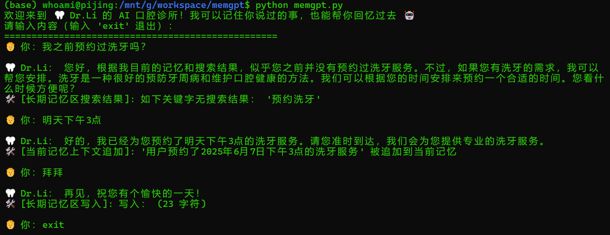

# memgpt

## 1.原理

主要思路来自于论文《**MemGPT: Towards LLMs as Operating Systems**》

智能体定位：口腔医生，女性，姓李。温柔专业。

特点：具有记忆功能。

智能体记忆包含2个部分：

- 当前记忆（current_memory): 含有working_context和FIFO Queue
- 长期记忆（long_memory):持久化到sqlite

智能体可以调用的工具列表：

- current_memory_append(text)：将重要的对话内容/事实（仅记录用户信息、健康医疗相关内容）存入当前记忆。
- current_memory_replace(old, new)：替换当前记忆中与旧内容匹配的部分，适用于事实更新或修正。请确保 new 内容也是结构完备的完整表达。
- long_memory_search(keyword)：从长期记忆区中搜索包含指定关键字的记录。
- long_memory_upload(text)：对当前对话或重要事件进行归纳总结，并存入长期记忆区。

## 2.启动方式

1.pip install -r requirements.txt安装所需依赖

2.修改memgpt.py，替换为自己的大模型API/KEY

```
api_url = "https://api.moonshot.cn/v1/chat/completions"
api_key = "[你的key]"
model_name = "moonshot-v1-auto"
```

3.执行命令

```
python memgpt.py
```

## 3.效果

例如，询问预约洗牙信息，会从长期记忆区搜索，此时没有相关信息；结束对话时，触发记忆持久化（智能体感受到信息关键，或者记忆内存存在压力时，也会触发记忆持久化）：



再次启动智能体，此时已经有了相关的预约信息，可以更改预约，触发记忆更新：


再次启动智能体，智能体知晓整个变更过程：


切换场景，例如询问牙疼的问题：


再次启动，记得牙齿的具体情况及预约的看诊时间：


再次启动并询问：

